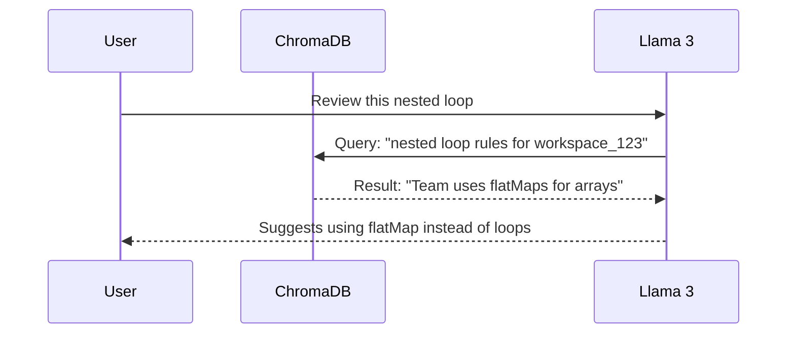

# RAG Architecture: Team Memory

DevLens differentiates itself from standard AI reviewers by "remembering" how your specific engineering team writes code.

## The Problem

Standard LLMs give generic advice. If your team prefers `Result<T, E>` monads for error handling, the AI will incorrectly suggest `try/catch` blocks because it lacks localized context.

## The Solution: ChromaDB + RAG

DevLens implements Retrieval-Augmented Generation (RAG) using **ChromaDB**.

1. **Embedding Pipeline:** When a senior engineer approves a PR or adds an architectural rule to the workspace settings, the Python service converts this text into a high-dimensional vector embedding.
2. **Semantic Search:** When a new PR is submitted, DevLens extracts the code snippet and performs a Cosine Similarity search against the ChromaDB vector store *for that specific workspace*.
3. **Context Injection:** The top 3 most relevant historical conventions are injected into the System Prompt before the code is sent to Groq/Llama3.

### Flow Diagram

