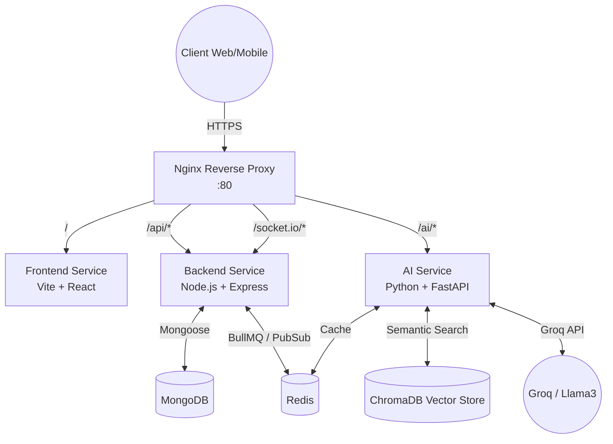
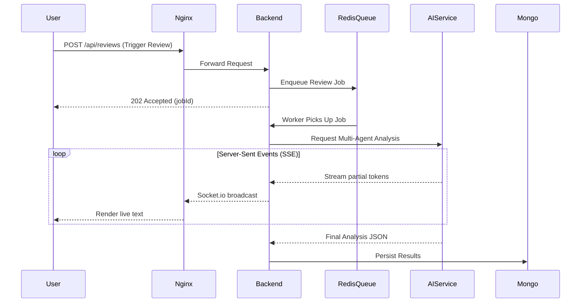

# DevLens System Architecture

DevLens is built on a highly scalable, containerized microservices architecture designed to handle concurrent AI workloads securely.

## High-Level Infrastructure

This diagram illustrates the Docker container orchestration and reverse proxy routing layer.

## AI Review Queue Pipeline

This diagram shows how DevLens offloads heavy AI reviews from the synchronous request lifecycle to prevent API timeouts.

