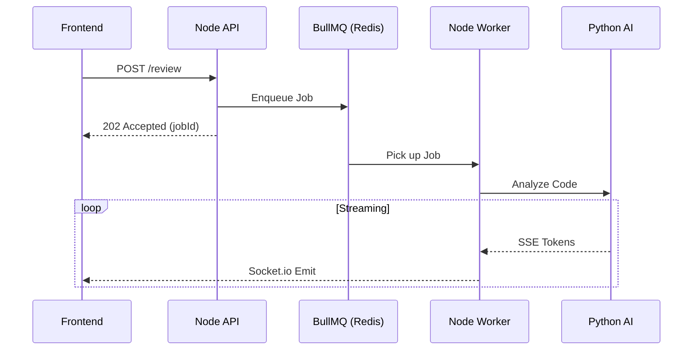

# Queue Infrastructure & Scaling

Handling LLM requests synchronously in Node.js is a recipe for disaster. API endpoints will timeout, memory will leak, and users will experience frozen UIs. 

DevLens solves this through a robust, asynchronous **Queue + Pub/Sub** architecture.

## The Tech Stack

1. **BullMQ:** Handles the robust job queuing, retries, and dead-letter queues.
2. **Redis:** The datastore for BullMQ, as well as the Pub/Sub broker for scaling WebSockets.
3. **Socket.io:** Pushes the final streamed results to the React frontend.

## The Request Lifecycle

1. A user submits a PR for review.
2. The Node.js Express API receives the request, instantly pushes a `ProcessReview` job to the BullMQ Redis queue, and immediately returns a `202 Accepted` to the frontend with a `jobId`.
3. The Node API is now completely free to handle other traffic.
4. A background Node Worker picks up the job from Redis.
5. The Worker makes an HTTP call to the Python AI Service.
6. As the Python AI Service generates tokens (Server-Sent Events), the Node Worker pipes those tokens into the `StreamGateway`.
7. The `StreamGateway` buffers the tokens in Redis and broadcasts them over `Socket.io` to the user's browser for that beautiful "typing" effect.

### Sequence Diagram

